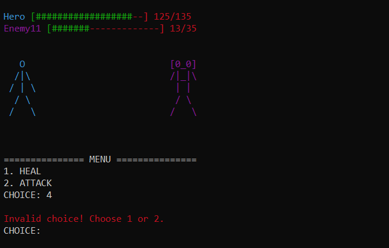
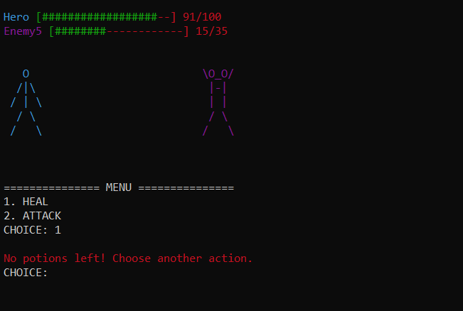

# Simple RPG Game (C++)

A console-based RPG game developed during the first year of my Computer Science degree.  
The project was created to practice Object-Oriented Programming concepts such as encapsulation, operator overloading, dynamic memory management, and the Singleton design pattern.

---

## Game Overview

The player fights a sequence of **15 enemies**, one at a time.  
Enemies are sorted by strength, so weaker ones are fought first.

The game continues until:
- All enemies are defeated (**Victory**), or
- The player’s health reaches 0 (**Defeat**).

After every **2 defeated enemies**, the player levels up and their stats increase.

---

## Player Actions

On each turn, the player can:

- `1` – Use a healing potion  
- `2` – Attack the current enemy  

After the player’s action, the enemy always attacks.

---

## Character Stats

Each character (player and enemies) has:

- **Level**
- **Attack Damage**
- **Defence**
- **Health Points**
- **Remaining Health**
- **Health Potions Count**

### Attack System

Damage dealt is calculated based on:
- The attacker’s **attack damage**
- The defender’s **defence**
- The defender’s **health points**

Defence reduces incoming damage, while higher attack increases damage dealt.

### Level Up

When leveling up:
- Level increases by 1
- Attack damage increases
- Defence increases
- Maximum health increases
- Health is fully restored

---

## Game Mechanics

- Stats are restricted between predefined **base** and **maximum** values.
- Health potions restore a fixed amount of health.
- Operator overloading is used for:
  - Stream input/output (`>>`, `<<`)
  - Character comparison (`<`, `>`, `==`, `!=`)
  - Level increment (`++`)
- The game instance is managed using the **Singleton design pattern**.

---

## Screenshots

### Level Up

### Healing Potion Used

### Invalid Command

### No Potions Left

